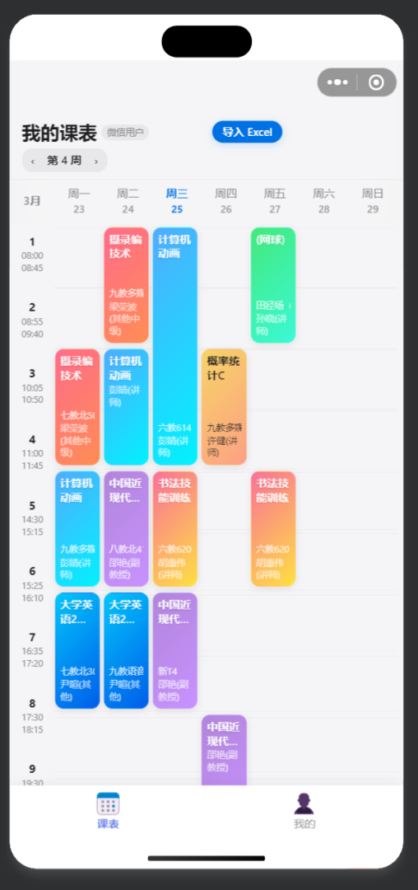
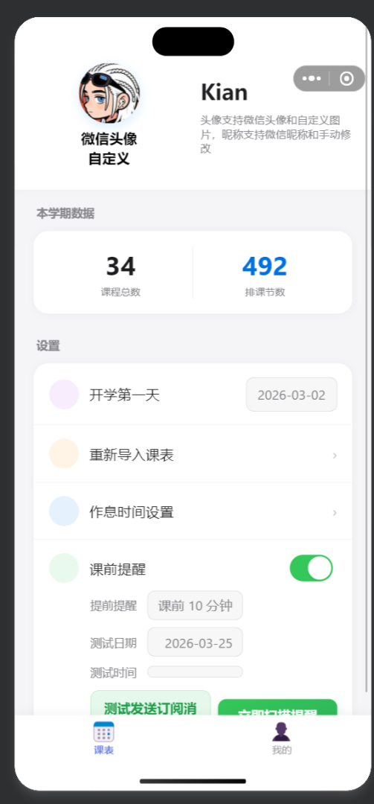
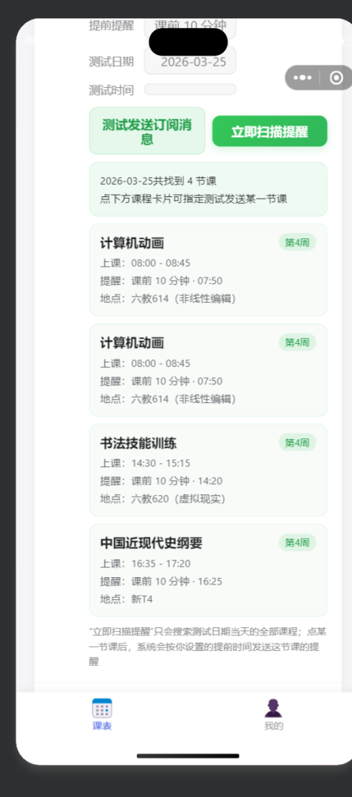

# 课程表微信小程序

一个基于**微信小程序 + 微信云开发**实现的课程表项目，支持课程表查看、课程信息管理、学期与作息设置、Excel 导入以及课前提醒等功能。

## 项目简介

这个仓库原始基础来自微信小程序示例工程，但当前已经整理为一个**面向校园课程管理场景的课程表小程序**。现在真正使用的核心模块集中在：

- `miniprogram/`：小程序前端
- `cloudfunctions/`：云函数后端
- `screenshots/`：项目截图

小程序当前主要包含两个页面：

- `pages/schedule/schedule`：课表页
- `pages/profile/profile`：我的 / 设置页

底部使用自定义 `tabBar`，入口清晰，适合作为课程表类小程序项目继续开发和扩展。

## 功能特性

- 课程表展示与按周查看
- 课程详情弹窗查看
- 云端保存 / 读取个人课表
- 学期开始日期设置
- 每日上课节次时间设置
- Excel 导入课程表
- 用户资料同步
- 课前订阅消息提醒
- 清空课表与基础统计能力

## 项目结构

```text
.
├─ miniprogram/                # 小程序前端主目录
│  ├─ app.js                   # 小程序入口逻辑
│  ├─ app.json                 # 全局页面与窗口配置
│  ├─ app.wxss                 # 全局样式
│  ├─ pages/
│  │  ├─ schedule/             # 课表首页
│  │  └─ profile/              # 我的 / 设置
│  ├─ components/
│  │  ├─ course-detail/        # 课程详情组件
│  │  └─ time-settings/        # 时间设置组件
│  └─ custom-tab-bar/          # 自定义底部导航
├─ cloudfunctions/             # 云函数目录
│  ├─ login/                   # 用户登录/初始化
│  ├─ getSchedule/             # 读取课表
│  ├─ saveSchedule/            # 保存课表
│  ├─ clearSchedule/           # 清空课表
│  ├─ getSettings/             # 获取设置
│  ├─ saveSettings/            # 保存设置
│  ├─ updateUserProfile/       # 更新用户资料
│  ├─ parseExcel/              # 解析 Excel 课表
│  └─ sendClassReminder/       # 发送课前提醒
├─ screenshots/                # README 展示截图
└─ README.md
```

## 技术方案

- **前端**：微信小程序原生开发
- **后端**：微信云开发云函数
- **数据存储**：云开发数据库
- **能力特点**：前后端一体化、适合快速迭代的小程序项目

从当前代码结构看，项目**强依赖微信云开发环境**。如果你要本地运行或二次开发，建议先完成云开发环境配置，再导入数据库集合和部署云函数。

## 运行方式

### 1. 准备工具

- 微信开发者工具
- 一个可用的微信小程序 AppID
- 已开通的微信云开发环境

### 2. 导入项目

使用微信开发者工具打开仓库根目录（即本项目目录）即可。


如有需要，请在开发者工具中配置：

- 小程序 AppID
- 云开发环境 ID
- `cloudfunctions/` 云函数根目录

### 3. 安装依赖

如果你的项目某些目录包含 npm 依赖，请在对应目录执行安装，再回到微信开发者工具中执行**构建 npm**。

常见情况：

```bash
npm install
```

> 是否需要安装依赖，以你当前工程里实际使用的 npm 包为准。这个项目的主体逻辑以小程序原生代码和云函数为主。

### 4. 部署云函数

在微信开发者工具中，进入 `cloudfunctions/`，将项目所需云函数部署到你的云开发环境，重点包括：

- `login`
- `getSchedule`
- `saveSchedule`
- `getSettings`
- `saveSettings`
- `parseExcel`
- `sendClassReminder`

### 5. 配置数据库与订阅消息

如果你要完整体验以下能力，需要同步配置：

- 用户信息相关集合
- 课表相关集合
- 设置相关集合
- 订阅消息模板与发送权限

## 适合继续扩展的方向

- 教务系统自动导入
- 多学期课程管理
- 考试安排与提醒
- 成绩查询整合
- 空教室 / 校历等校园服务接入
- UI 视觉与交互优化

## 截图

### 课表首页



### 我的页面



### 提醒设置与扫描结果



## 仓库说明

如果你是第一次接手这个项目，建议优先阅读以下内容：

- `miniprogram/app.json`：确认页面入口与全局配置
- `miniprogram/pages/schedule/`：理解课表渲染主流程
- `miniprogram/pages/profile/`：理解用户设置与提醒配置
- `cloudfunctions/`：查看后端数据处理与提醒逻辑

## License

本仓库保留原项目中的 `LICENSE` 文件。如你准备对外发布或商用，请自行确认依赖资源、素材与业务代码的授权范围。
